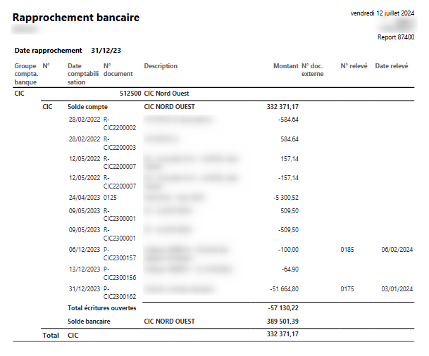
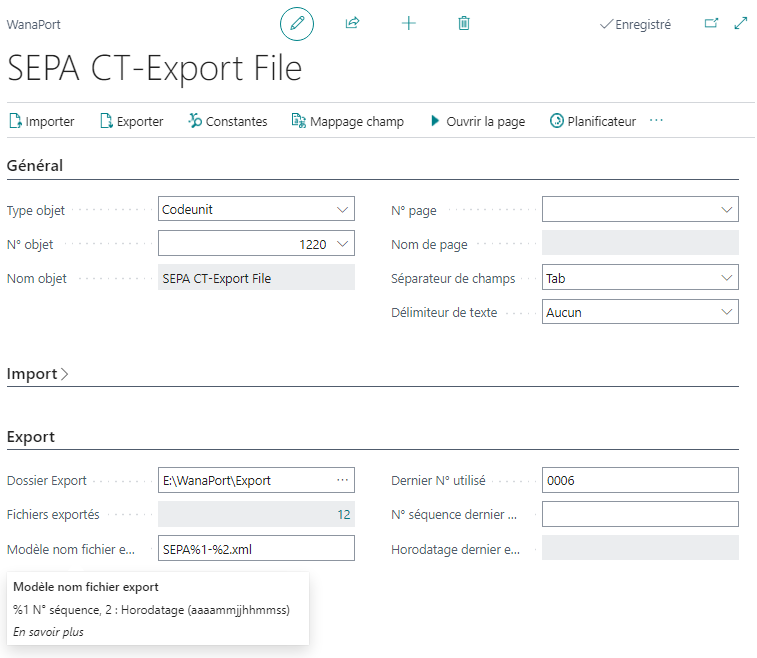
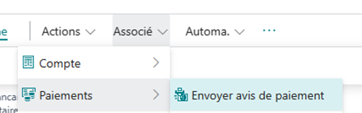
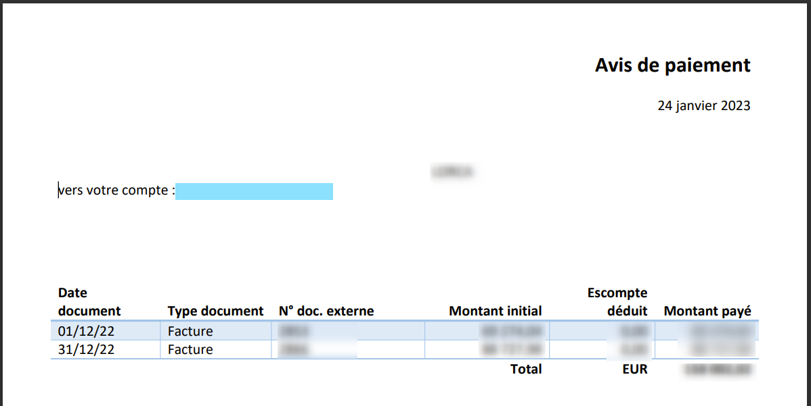
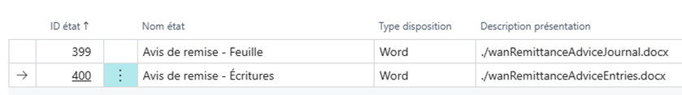
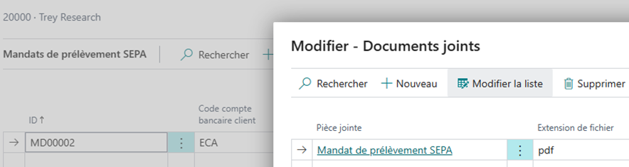
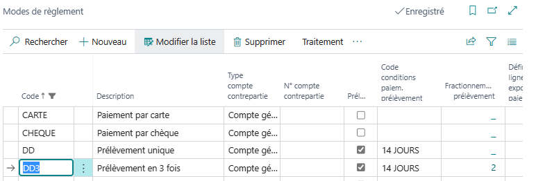
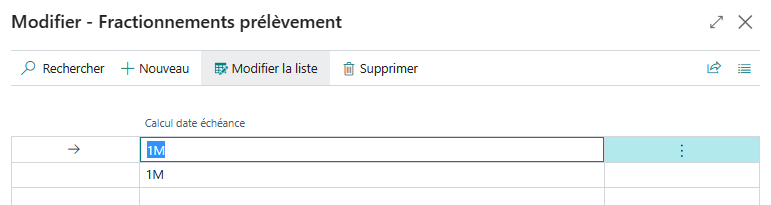

# Extension WanaBank

Cette extension regroupe plusieurs fonctionnalités relatives aux relations bancaires ou relevant des paiements et des règlements.

### Sommaire
- [Feuille rapprochement](#feuille-rapprochement)
  - [Import CFONB120](#import-cfonb120)
  - [Import CFONB120 sans séparateur](#import-cfonb120-sans-séparateur)
- [Etat de rapprochement bancaire](#etat-de-rapprochement-bancaire)
- [Balance des comptes bancaires](#balance-des-comptes-bancaires)
- [Feuille règlement](#feuille-règlement)
  - [Remise de chèques](#remise-de-chèques)
- [Feuille paiements](#feuille-paiements)
  - [IBAN des bénéficiaires](#iban-des-bénéficiaires)
  - [Export des fichiers de virements](#export-des-fichiers-de-virements)
  - [Avis de paiement](#avis-de-paiement)
- [Centralisation des contreparties](#centralisation-des-contreparties)
- [Recouvrement et mandats de prélèvements](#recouvrement-et-mandats-de-prélèvements)
  - [Créer recouvrement prélèvements](#créer-recouvrement-prélèvements)
  - [Modifier lignes prélèvements](#modifier-lignes-prélèvements)
  - [Exporter un fichier de prélèvements](#exporter-un-fichier-de-prélèvements)
  - [Valider et centraliser au compte bancaire](#valider-et-centraliser-au-compte-bancaire)
- [Mandats SEPA](#mandats-sepa)
- [Prélèvement fractionné](#prélèvement-fractionné)
  - [Impact du fractionnement](#impact-du-fractionnement)
  - [Remarques](#remarques)
  - [Configuration](#configuration)

## Feuille rapprochement
### Import CFONB120
Business Central dispose d’une fonctionnalité de rapprochement bancaire, dont l’efficacité a bien progressé de version en version, mais à quoi cela sert il d’automatiser le rapprochement s’il faut préalablement saisir les lignes du relevé bancaire !

La fonction d’import largement paramétrable proposée à cet effet a du mal à ingurgiter le format *CFONB120* (parfois nommé ETEBAC par abus de langage) proposé par les banques françaises.

Alors, en attendant la généralisation du format CAMT.053 proposé par les normes SEPA et censé le remplacer depuis bien longtemps, cette fonction vous permet d’importer un fichier au format historique.

Outre l’import des lignes proprement dites, les commentaires souvent utiles au rapprochement sont également repris et proposé dans le volet des récapitulatifs.

Cette action disponible depuis la liste des **Feuilles rapprochement bancaire** créera autant de relevé que de comptes concernés dans le fichier (tout en regroupant sur un même relevé les opérations de plusieurs dates).

### Import CFONB120 sans séparateur
Dans certains cas (ex : Société générale), les lignes du fichier téléchargé ne sont pas délimitées.

Cette action peut être ajoutée (Personnaliser) et il faudra alors choisir l’une ou l’autre des actions selon l’origine du fichier.

## Etat de rapprochement bancaire
Cet état permet de justifier le détail des écritures non rapprochées, en particulier à la date de clôture de l’exercice.

## Balance des comptes bancaires
La version standard propose un grand livre des comptes bancaires (basé sur les **Ecritures compta. compte bancaire** et non le **Écritures comptabilité**), mais ne dispose pas de la balance correspondante.

Certes, un compte général distinct est souvent associé à chaque compte bancaire et la balance générale est alors suffisante.

Si en revanche vous avez souhaité préserver un plan comptable simplifié sans le polluer de comptes pouvant différer d’une société à l’autre, vous avez opté pour un compte centralisateur.

Cette balance vous sera alors utile.

## Feuille règlement
### Remise de chèques
La colonne **N° doc. externe** est ajoutée pour permettre d’annoter le N° chèque.

Ce dernier est repris sur la remise de chèque (propre à la localisation française), ainsi que le nombre de chèque :

La présentation d’état doit être configurée à cet effet :

## Feuille paiements
### IBAN des bénéficiaires
L’**IBAN** est ajouté à la liste (DropDownList)

De même, le cartouche (FactBox) est complété de l’**IBAN** :

### Export des fichiers de virements
Les fichiers générés pour les virements SEPA sont par défaut enregistrés dans le dossier Téléchargement de l’utilisateur.

Dans le cas d’une installation sur vos serveurs (On Premise), l’extension WanaPort permet de les enregistrer automatiquement dans un dossier dédié.

Par exemple :

### Avis de paiement
Un avis de paiement peut être adressé au fournisseur (imprimé ou par e-mail) pour justifier le détail du paiement :

Il est obtenu depuis la feuille de paiements (avant validation, report 399) ou depuis les **Ecritures comptables fournisseur** (après validation, report 400).

Des modèles Word (Word Layout) proposés à cet effet pourront être configurés via la **Sélection présentation états** :

**Remarques**
* La version standard permet d’imprimer ces états mais l’envoi par e-mail n’est pas proposé.
* Il n’est pas proposé d’état similaire pour les paiements aux salariés ou aux clients (remboursements).
* Cet état reprend le détail des écritures lettrées. Il ne mentionne pas les règlements *spontanés* (non liés à une facture). Le règlement d’un acompte doit donc correspondre à une facture d’acompte.

## Centralisation des contreparties

Si votre banque centralise les opérations sur une même ligne du relevé, cette option optimisera le rapprochement bancaire (une ligne de part et d'autre).

Une option **Totaliser contrepartie** est ajoutée au **Noms feuilles comptabilité** (quel qu'en soit le **Type** mais principalement pour celles de type *Paiement* ou *Règlement*).

Si elle est retenue, lors de la validation de la feuille, les lignes dont le **N° compte contrepartie** correspond à celui défini pour ce même **Nom de feuille** sont préalablement centralisées par **Date comptabiliation** et par **Code devise** (un même **N° document** leur est attribué).

Vous pouvez définir plusieurs **Nom feuille** pour une même banque si certaines transactions sont centralisées et d'autres pas (ex : les Virements SEPA sont centralisés mais pas ceux en devises).\
Veillez à leur attribuer un nom explicite pour les utiliser à bon escient !

## Mandats SEPA
Il peut être imprimé depuis un **Compte bancaire client** (même si le compte, et donc l’IBAN, n’est pas encore connu) :

Il s’agit d’une présentation Word (Word Layout) personnalisable si nécessaire (la présentation proposée est celle d’un mandat SEPA de type *Core* et devra donc être adaptée en cas de mandat *B2B*).

La liste des mandats est complétée du volet permettant d’associer des pièces jointes.

Une fois signé, le mandat pourra ainsi y être attaché :

## Recouvrement
### Créer recouvrement prélèvements
Les écritures client dont le code **Suspendu** n’est pas vide ne sont pas proposées.
Rappelons que ce code (jusqu’à 3 caractères) peut être annoté lors de la saisie (via la feuille de saisie ou sur le document de vente) et/ou modifié (depuis **Ecritures comptables client**) pour mettre une écriture en attente.

### Modifier lignes prélèvements
Ce traitement propose d’harmoniser la **Date transfert**. Ainsi, la validation centralisée générera une unique écriture au compte bancaire.

Elle permet également de compléter les **ID mandat** manquants en y reprenant le premier mandat disponible pour le client concerné . Elle s’applique en particulier aux factures validées avant la mise en œuvre des prélèvements.

### Exporter un fichier de prélèvements
Comme pour les virements (voir plus haut), les fichiers générés pour les prélèvements SEPA sont par défaut enregistrés dans le dossier Téléchargement de l’utilisateur.

Dans le cas d’une installation sur vos serveurs (On Premise), l’extension WanaPort permet de les enregistrer automatiquement dans un dossier dédié (en y configurant le Codeunit 1230 **SEPA DD-Export File**).

### Valider et centraliser au compte bancaire
Lors de la validation, la contrepartie au compte bancaire est centralisée par **Date transfert** et **N° compte** afin de faciliter le rapprochement bancaire. Le **N° document** est réattribué à cet effet (idem action **Renuméroter des documents**).

## Prélèvement fractionné

Cette facilité de paiement peut être utilisée pour les prélèvements.

Pour mémoire, il ne s’agit pas d’un crédit à la consommation dès lors que le fractionnement ne dépasse pas 90 jours.

### Impact du fractionnement
Lors de la génération d’une proposition de recouvrement prélèvement, le montant proposé tient compte du fractionnement.

Ainsi par exemple, si 2 fractionnements sont associés au mode de règlement concerné (donc 3 échéances au total), une facture de 300€ donnera lieu à un premier prélèvement de 100€.

La validation de ce recouvrement (action **Valider reçus paiements**) viendra lettrer partiellement la facture concernée (et déclenchera donc la TVA sur encaissements correspondante le cas échéant), et l’échéance de celle-ci sera reportée du **Calcul date échéance** défini pour le premier fractionnement (voir ci-après).

### Remarques
* Les éventuels frais associés doivent être pris en compte sur la facture.\
Cette dernière pourra également mentionner les dates de prélèvements.
* Le montant de la facture est fractionné en parts égales (à l’arrondi près). Les éventuels frais liés au fractionnement sont donc répartis sur chacune des échéances.
* Le montant proposé ne concerne qu’une échéance (même si, du fait d’un recouvrement tardif, l’échéance de la suivante est déjà dépassée).
* En cas de rejet d’un prélèvement après validation, il faudra modifier manuellement la date d’échéance de l’écriture client.
* Le fractionnement tient compte du **Code mode de règlement** de l’écriture client (et non de celui du client). Il peut donc être modifié à ce niveau (en particulier si, suite à un rejet de prélèvement, le client opte pour un autre mode de paiement).
* Le fractionnement n’est pas pris en compte pour les prévisions de trésorerie (basées sur les dates d’échéance pour les écritures client). Le montant ouvert d’une écriture en prélèvement fractionné est positionné à la date du prochain prélèvement.
* Le fractionnement est associé à un mode de règlement (et non à une condition de paiement) et ne peut être associé qu’à un mode pour lequel **Prélèvement** est coché.

### Configuration
La liste des modes de règlement est complétée d’une colonne 

**Fractionnements prélèvement** indiquant le nombre de fractionnement complémentaire (en plus du prélèvement initial).

Depuis cette colonne ou via l’action **Fractionnements prélèvement**, le report d’échéance est précisé pour chaque fraction :

Attention : l’ajout ou la suppression d’un fractionnement alors que des prélèvements fractionnés ont déjà été émis aurait un impact sur les suivants.